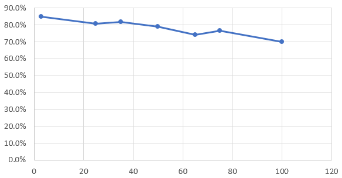

## List of characters

Currently, 100 characters are picked from 25 animation series.

1. Angel Beats!: Tachibana Kanade
2. Charlotte: Tomori Nao
3. Chuunibyou demo Koi ga Shitai!: Dekomori Sanae, Nibutani Shinka, Takanashi Rikka
4. Date A Live: Itsuka Kotori, Tobiichi Origami, Tokisaki Kurumi, Yatogami Tohka, Yoshino
5. Eromanga-sensei: Izumi Sagiri, Yamada Elf
6. Evangelion: Ayanami Rei, Souryuu Asuka Langley
7. Fate Series: Illyasviel von Einzbern, Matou Sakura, Miyu Edelfelt, Saber, Tohsaka Rin
8. Gochuumon wa Usagi desu ka?: Hoto Cocoa, Jouga Maya, Kafuu Chino, Kirima Sharo, Natsu Megumi, Tedeza Rize, Ujimatsu Chiya
9. K-On!: Akiyama Mio, Asahina Mikuru, Hirasawa Yui, Kotobuki Tsumugi, Nakano Azusa, Tainaka Ritsu
10. Kancolle: Hibiki, Kashima, Kongou, Shigure
11. Kiniro Mosaic: Alice Cartelet, Inokuma Youko, Komichi Aya, Kujou Karen, Oomiya Shinobu
12. Kono Subarashii Sekai ni Shukufuku wo!: Aqua, Dustiness Ford Lalatina, Megumin
13. Love Live!: Ayase Eli, Hoshizora Rin, Koizumi Hanayo, Kousaka Honoka, Minami Kotori, Nishikino Maki, Sonoda Umi, Toujou Nozomi, Yazawa Nico
14. Love Live! Sunshine!!: Kunikida Hanamaru, Kurosawa Dia, Kurosawa Ruby, Matsuura Kanan, Ohara Mari, Sakurauchi Riko, Takami Chika, Tsushima Yoshiko, Watanabe You
15. Madoka Magica: Akemi Homura, Kaname Madoka, Miki Sayaka, Sakura Kyouko, Tomoe Mami
16. New Game!: Sakura Nene, Suzukaze Aoba, Takimoto Hifumi, Yagami Kou
17. Nisekoi: Kirisaki Chitoge, Onodera Kosaki
18. Ore no Imouto ga Konnani Kawaii Wake ga Nai: Aragaki Ayase, Gokou Ruri, Kousaka Kirino
19. Re:Zero kara Hajimeru Isekai Seikatsu: Emilia, Ram, Rem
20. Saenai Heroine no Sodatekata: Hyoudou Michiru, Kasumigaoka Utaha, Katou Megumi, Sawamura Spencer Eriri
21. Steins;Gate: Makise Kurisu, Shiina Mayuri
22. Suzumiya Haruhi no Yuuutsu: Nagato Yuki, Suzumiya Haruhi
23. Sword Art Online: Asuna, Kirigaya Suguha, Leafa, Lisbeth, Silica, Sinon, Yui
24. Toaru Kagaku no Railgun: Misaka Mikoto, Saten Ruiko, Shirai Kuroko, Uiharu Kazari
25. Yahari Ore no Seishun Love Comedy wa Machigatteiru: Yuigahama Yui, Yukinoshita Yukino

## Test results with 100 class

Each class only contains around ~~30~~* 60 images.

(*) The number of dataset is increased from ~30 to ~60 and the overall accuracy is increased by 5% to 10% (from 60% - 65% to 70%).

Since we are using a very small number of images (in order to be as realistic as possible), we need to modify `retrain.py`.
If we don't modify it, validation list will be empty for several characters, which will cause division by zero exception.

https://github.com/tensorflow/tensorflow/blob/r1.4/tensorflow/examples/image_retraining/retrain.py#L193-L198:

```
      if len(validation_images) == 0:
        validation_images.append(base_name)
      elif len(testing_images) == 0:
        testing_images.append(base_name)
      elif percentage_hash < validation_percentage:
        validation_images.append(base_name)
      elif percentage_hash < (testing_percentage + validation_percentage):
        testing_images.append(base_name)
      else:
        training_images.append(base_name)
```

This mechanism allows validation & testing percentage somewhere between 10% - 15%, but it guarantees at least 1 image exists in each category.

## Results

The experiment is done twice, with ~30 images per category and ~60 images per category later on.

**Results of ~30 images per category**:

|Number of Categories|Learning Rate|Training Steps|Final Train Accuracy|Final Test Accuracy|
| --- | --- | --- | --- | --- |
| 100 | 0.01 | 4000 | 89.0% | 53.0% (N = 385) |
| 100 | 0.02 | 4000 | 98.0% | 56.9% (N = 385) |
| 100 | 0.01 | 8000 | 99.0% | 59.2% (N = 385) |
| 100 | 0.02 | 8000 | 100.0% | 59.7% (N = 385) |
| 100 | 0.005 | 16000 | 97.0% | 59.0% (N = 385) |
| 100 | 0.02 | 16000 | 100.0% | **60.3% (N = 385)** |

The initial model accuracy is **60.3%**.
 
Tested stuffs:
- At several occasions, the number of training steps was increased to 40000 with no avail (no significant changes)
- Hyperparameter tuning was experimented (random crop 5% random brightness 5%), but the result only has 1% difference and it took the entire day to run

**Result of ~60 images per category**:
|Number of Categories|Learning Rate|Training Steps|Final Train Accuracy|Final Test Accuracy|
| --- | --- | --- | --- | --- |
| 3 | 0.02 | 4000 | 100.0% | **85.0% (N=20)** |
| 25 | 0.02 | 4000 | 100.0% | **80.6% (N=175)** |
| 25 | 0.01 | 4000 | 100.0% | 80.6% (N=175) |
| 35 | 0.02 | 4000 | 100.0% | **81.7% (N=219)** |
| 35 | 0.01 | 4000 | 100.0% | 78.1% (N=219) |
| 50 | 0.02 | 4000 | 99.0% | 77.4% (N=318) |
| 50 | 0.02 | 8000 | 100.0% | **78.9% (N = 318)** |
| 65 | 0.02 | 16000 | 100.0% | **74.2% (N = 438)** |
| 75 | 0.02 | 4000 | 93.0% | 71.1% (N=477) |
| 75 | 0.02 | 8000 | 98.0% | 74.2% (N=477) |
| 75 | 0.02 | 16000 | 98.0% | **76.7% (N=477)** |
| 100 | 0.02 | 4000 | 85.0% | 64.1% (N=682) |
| 100 | 0.02 | 8000 | 94.0% | 67.9% (N=682) |
| 100 | 0.02 | 16000 | 94.0% | **70.1% (N=682)** |



TODO:
- Investigate the correlation between number of categories vs final test accuracy (diminishing rate)
- Improve character detection: rotation / axis
- Improve character recognition: image noise, brightness / contrast, border, facial expression (closed eyes, etc),  characters with more than 1 form (DAL, SAO, ...)
